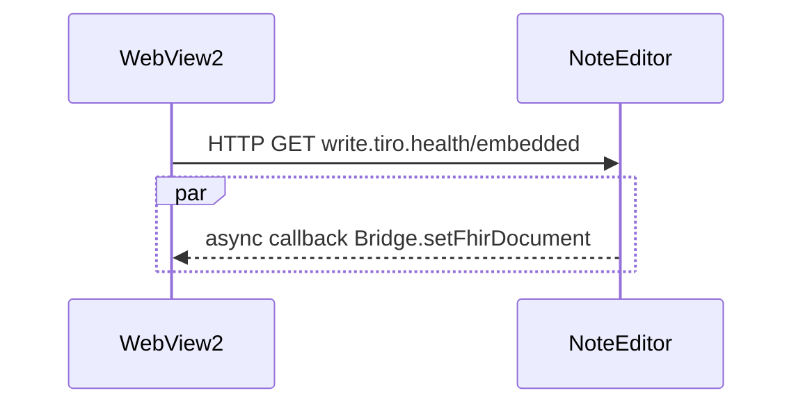

# Tiro.health Embedded API

Tiro.health offers an API to embed it's Note Editor web application into your application.

## Two-way communication through messages
Communicating from a host application, beit native or a web app, is as simply as opening a URL using HTTPS GET. The backward communications depends on your setup. The host application can launch the app inside a browser window, an [`<iframe>`](https://developer.mozilla.org/en-US/docs/Web/HTML/Element/iframe) or a embedded browser like [Microsoft Edge WebView2](https://docs.microsoft.com/en-us/microsoft-edge/webview2/) or [Java CEF](https://bitbucket.org/chromiumembedded/java-cef/).

## 1. Launching the NoteEditor using HTTP GET

The Atticus web application is available on [https://write.tiro.health](https://write.tiro.health).
If you're embedding the application and you want toolbars and navigations inside Atticus to be hidden, use [https://write.tiro.health/embedded/](https://write.tiro.health/embedded/).

If you're using Atticus for a specific project you probably will have a specific subdomain (ex *project-x.tiro.health* ). Make sure you use this custom url instead of the general one in order to make sure project specific features are available.

Additionally you can pass parameters to couple the notes to specific patients, encounters and practitioners from inside your system.
All of them are optional, the more you're passing the smoother the user experience will be

| parameter | expected value | description |
|----------|----------------|-------------|
| `apiKey` | string | unique key that identifies and authenticates the host application, (omitting this will demand the end-user to login) |
| `patient` | string | unique identifier for current patient |
| `encounter` | string | unique identifier for current encounter, this should be **globally unique across patients** |
| `practitioner` | string | unique identifier for current practitioner | 
| `age` | number | integer number representing current patient's age |
| `yob` | number | integer number representing the birthyear of a patient |
| `dob` | number | formatted string that represents the date of birth of a patient |
| `sex` | enum | term indicating the patient's sex; valid options are `male`, `female`, `other` |
 <i> \* required </i>

More information on all these parameters
### 💾  Passing an encounter identifier, allows you to reopen notes in the future
*To Be Completed*

### ⏱ A patient identifier enables to transfer information across encounters.
Often, a lot of information is already filled in during previous encounter and you just want to copy-paste from previous report. This is possible if your system is passing a patient identifier. 

*To Be Completed*

### 📄 The practitioner enables to learn the end-users jargon
*To Be Completed*

### 👨‍👦‍👦 Patient demographics will improve the terminology suggestions
*To Be Completed*

## 2. Enabling communication from the web application to the host

### 2.1 Receiving `message`-events from Atticus inside an <iframe />

### 2.2 Using messages in a native .NET application using a Microsoft Edge WebView2 component
The Microsoft Edge WebView2 component is a super performant browser component. It let's you open the Note Editor web application but also enables you to exposes callbacks for backawards communication form the web app to the host. By buidling a simple class that contains a *setter* method, you enable the Note Editor to write back information to your host application in a secure manner! We will refer to this class as the **bridge**. 

Let's look at an example implementation of such `Bridge` in C#:
```C#
[ClassInterface(ClassInterfaceType.AutoDual)]
[ComVisible(true)]
public class Bridge
{
    /*
        standard constructor 
    */
    
    // this function will be called by the NoteEditor to send back it's content in a FHIR/JSON format
    public void setFhirDocument(string fhirJsonDocument)
    {   
        // this parser is used to convert and validate the received JSON
        var parser = new FhirJsonParser(new ParserSettings
        {
            AcceptUnknownMembers = true,
            AllowUnrecognizedEnums = true
        });

        try
        {   
            // this is a FHIR Bundle
            this._response = parser.Parse<Bundle>(fhirJsonDocument); 

            // the first resource is a Composition containing a plain-text version of each section
            var composition =(Composition)this._response.Entry.First().Resource;

            foreach(var section in composition.Section){
                /**
                    Here you can process the section;
                    section.Code contains codes to differentiate different sections
                    section.Title contais the title of each section
                    section.Text contains the content of each section

                */

                // replace the URI with the system URI you need.
                var code = section.Code.Coding.Find((c) => c.System == "http://tce.tiro.health/fhir/DocumentSections").Code; 
                Console.WriteLine(code);
                Console.WriteLine(section.Title);
                Console.WriteLine(section.Text.Div);
            }

        }
        catch (FormatException fe)
        {
            Console.WriteLine(fe.ToString());
        }
    }
}

// inside your form you have to initialize the Bridge
public partial class Form1 : Form
{
    public Form1()
    {
        InitializeComponent();
        InitializeAsync();
    }

    async void InitializeAsync()
    {
        await webView21.EnsureCoreWebView2Async(null);
        // notice the first parameter 'bridge'; this is the name by which the Tiro.health note editor will have access to the class instances
        webView21.CoreWebView2.AddHostObjectToScript("bridge", new Bridge(this));
    }

```
In the `setFhirDocument` callback, the content of the note editor is parsed, validated (based on FHIR) and then set to the `this._response` variable. This variable `this._response` is a FHIR bundle. Its first entry contains a Composition resource. This is an object that contains the titles and text of each section.
For more info [check the site of Firely](https://docs.fire.ly/projects/Firely-NET-SDK/model/bundles.html#looking-at-the-content)

### 


